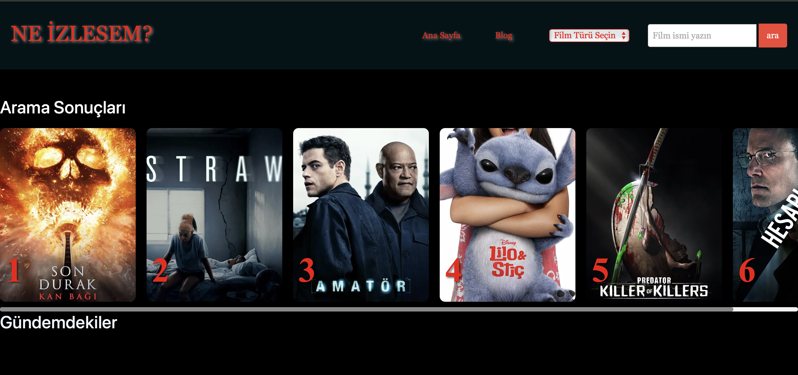
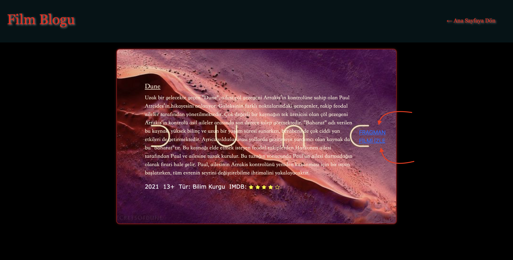

Ne İzlesem?

**Ne İzlesem?** projesi, kullanıcının ruh haline, izleme ortamına, tercih ettiği türe ve yıllara göre film önerileri sunan dinamik bir web uygulamasıdır. TMDB API kullanılarak gerçek zamanlı film verilerine erişim sağlanır.
---
Geliştiriciler

- İkra Demir – 230229076  
- Gülsüm Çakmak – 230229051  
- Yıldız Ay – 230229078  

---
Kullanılan Teknolojiler

- HTML5  
- CSS3  
- JavaScript (Vanilla)  
- Bootstrap 5.3  
- Font Awesome  
- [TMDB API](https://www.themoviedb.org/documentation/api) – Film verileri için

---
Proje Özellikleri

Ana Sayfa (`webproje.html`)
- **Mod seçimi**: Mutlu, Nötr, Üzgün
- **İzleme ortamı**: Bireysel, Date, Aile, Çocuklar
- **Tür tercihi ve yıl aralığı**: Çoktan seçmeli sistem
- **Son aşamada size özel film önerisi**

Popüler Filmler
- TMDB'den çekilen popüler 6 film
- Poster, açıklama, çıkış tarihi ve IMDb puanı
- Modal pencere ile detaylı inceleme

Arama Motoru
- Film adıyla arama yapma
- Bulunan ilk 6 film kart olarak gösterilir

Film Türü Seçimi
- Belirli türe göre 6 film önerisi (aksiyon, komedi, bilimkurgu, vs.)

Blog Sayfası (`bloghtml.html`)
- 6 sabit film tanıtımı
- Tür, yıl, IMDb yıldızları, fragman ve izleme linki

---
Kurulum ve Kullanım

1. Tüm dosyaları aynı klasöre yerleştirin.
2. `webproje.html` dosyasını bir tarayıcıda açın.
3. Blog kısmına gitmek için “Blog” linkine tıklayın.
4. API anahtarınız varsa `yenijs.js` içinde kendi TMDB `API_KEY` değerinizi kullanabilirsiniz.

ANA SAYFA GÖRSELİ 

**Web sitesi açıldığında sizi ilk ana sayfa karşılar. Bu sayfanın görseline ‘imgreadme’ den ulaşabilirsiniz. Bu sayfada menü bölmesinde sitenin adını, sitede başka bir sekme açtığınızda geri dönebilmeniz için ana sayfa butonu, kendi yazdığımız bloga götüren butonu ve API’ın bünyesinde bulunan tüm filmleri aratabileceğiniz arama motoru bulunmaktadır. Aynı zamanda sayfanın orta kısmında girdiğiniz anda gündemde olan filmlerin sıralamasını da görebilirsiniz.

FİLM AÇIKLAMASI GÖRSELİ

**Sayfada bulunan herhangi bir filmin üzerine tıkladığınızda filmin açıklama modaline ulaşırsınız. Bu modalin görseline ‘imgreadme’ den ulaşabilirsiniz. Bu modalde filmin posteri, vizyona girme tarihi, türü, süresi, IMDb puanı ve konusu bulunmaktadır. 

BLOG SAYFASI GÖRSELİ

**Blog tuşuna bastığımızda bizi bir blog sayfası karşılar. Bu sayfada kendi seçtiğimiz filmler hakkında bilgiler bulunmaktadır. Aynı zamanda bu filmlerin fragmanına ve filmi izleyebileceğiniz bir sayfaya gönderen butonlarda bulunmaktadır. Ana sayfaya dönmek için sağ üst tarafta bir buton bulunmaktadır.

FİLM TÜRÜ SEÇİMİ GÖRSELİ

** Sitemizin en üst partında yer alan bu seçim tuşu ile kullanıcı aksiyon, dram, komedi, korku veya bilim kurgu türlerinden birini seçip sitemiz o türe uygun 6 film önerisi oluşturur.

ARAMA MOTORU GÖRSELİ

** Sağ üstte bulunan arama motoru ile film ismini aratınca uygun film konu ,süre ,imbd gibi açıklamalar ile kullanıcıyı istediği sonuca yönlendirir.

SIKÇA SORULAN SORULAR GÖRSELİ

** Sitemizin ana sayfasının en altında yer alan sıkça sorulan sorular bölümü ile kullanıcıların sitemizi ziyaret ettiğinde akıllarında oluşabilecek olan yaygın soruları önceden yanıtlayıp sitemizi ilk kez ziyaret edenlere yönlendirici, açıklayıcı, ve kullanım kolaylığı sağlayan bir bölümümüz bulunmaktadır. Kullanıcı soruların hemen altında yer alan sarı artı simgesinin olduğu satıra imlecini getirerek cevaplara harekete duyarlı şekilde ulaşabilir.

SORULARA GİDİŞ GÖRSELİ

**Hemen basla
Burada kendi secimlerine gore film bulmak için kullanıcıyi 4 soruya yönlendiren Hemen başla butonu bulunmaktadır.Hemen başla butonuna tıklayınca hemen altta kullanıcıyı ilk soru karşılar.

SORU-CEVAP GÖRSELİ

**Film öneri uygulamanın soru-cevap mekanizmasının bir adımını gösteriyor. Kullanıcının tercihlerine göre en uygun filmi önermek için birkaç adımlı bir soru-cevap sistemine sahiptir.4 soruyu cevaplayacak şekilde oluşturulmuştur .
bunlar: 
1. Moduna gore 
2. Sizin için en uygun durum hangisi?
3. Lütfen Tür Seçiniz?
4.Hangi Yıllar Arasında Olsun?

Bu panel de bulunan next butonu bir sonaki soruya geçişini sağlamaktadır.

FİLM ÖNERİ SONUÇ GÖRSELİ

**Film Önerisi Sonucu
Kullanıcı, 4 aşamalı soru-cevap sistemini tamamladıktan sonra, verdiği cevaplara en uygun film algoritma tarafından seçilerek önerilir.Bu filtrelere uygun filmler TMDb API’den çekilir.
En yüksek puanlı veya rastgele bir film önerilir.

Not: Eğer uygun film bulunamazsa, kullanıcıya bilgi mesajı gösterilir ve farklı tercihlerle tekrar denemesi istenir.

---

##  Lisans

Bu proje eğitim amaçlıdır. TMDB API sadece açık kaynak veya eğitim projeleri için kullanılmalıdır.

---

##  Ek Notlar

- Responsive tasarım mobil cihazlarda da çalışır.
- JavaScript kodu oldukça modüler ve geliştirilebilir.
- Daha fazla tür/durum seçimi eklenerek öneri algoritması genişletilebilir.
